FAVERO TESTER-A2
===================================

The `Favero TESTER-A2 <https://www.favero.com/en2_fencing_sport_electronic_tester_device_for_three_weapons_and_cables_of_fencing_foil_sword_epee_sabre-242-17.html>`_
is an electronic tabletop tester for all three weapons.

Fixed *C* point for testing mask wires
----------------------------------------------------------

.. note::

    This modification as not been tested on new Favero TESTER-A2 without the printout for italian bayonet socket option.

While testing mask wires, the Favero TESTER-A2 provide a fixed point to clip the crocodile clip on *C'* but not on *C*. 
Favero provide a crocodile clip attachment point that you can plug on *C* but it can easily be lost.
If the Favero TESTER-A2 is ordered without the optional italian bayonet socket option, there is space to install a fixed point to clip the crocodile clip on *C*.

The modification kit consist of the following:
- 1 stainless steel M4 × 35mm round head screw;
- 6 stainless steel M4 serrated lock washers;
- 1 stainless steel M4 × 8mm × 0,8mm plain washer;
- 1 stainless steel M4 × 16mm × 0,8mm plain washer;
- 3 stainless steel M4 × 14mm × 0,8mm plain washer;
- 1 nylon M4 × 20mm × 1mm plain washer;
- 1 stainless steel M4 × 4mm hexagon nut;
- 1 stainless steel M4 × 3mm hexagon nut;
- 1 stainless steel M4 flange serrated self-locking hexagon nut;
- 1 M4 insulated ring terminal for 18AWG wire;
- 14cm of 18AWG single core insulated wire.

1. Open the tester by removing the 4 screws (PH2) on the bottom.

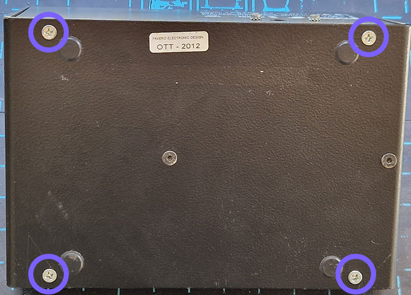

2. Separate the two sides of the tester by disconnecting the batteries.

.. note::
    It is recommend not to try disconnecting the batteries connector on the PCB. This connector is both difficult to disconnect and fragile.
    It is better to disconnect the connections on the batteries. The connection between the batteries, blue wire, can be left connected.

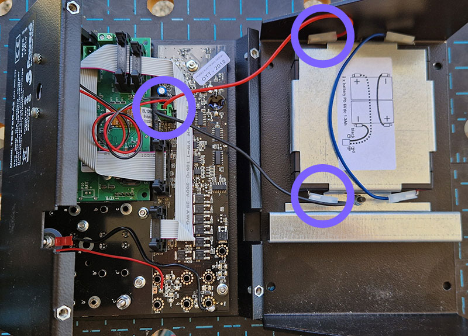

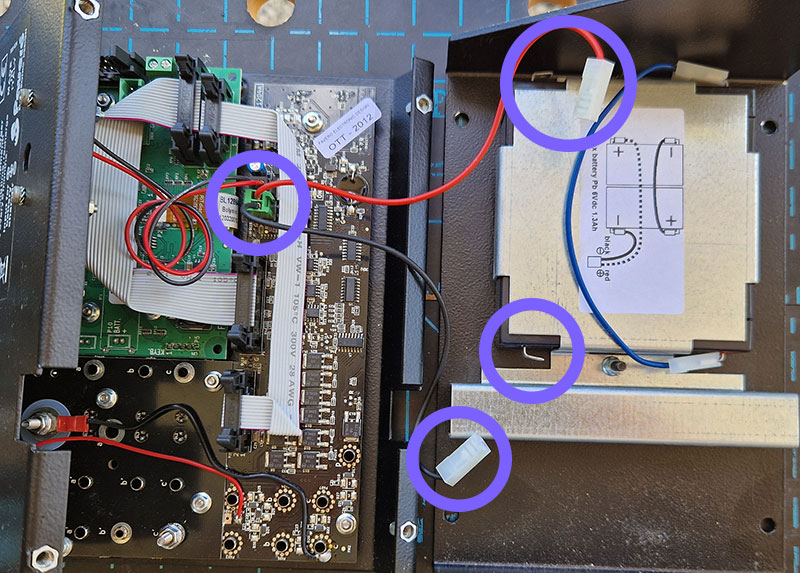

3. Put aside the side holding the batteries.

4. Make a hole of at least 5mm and no more than 10mm diameter in the center of the markings for the italian bayonet socket option.

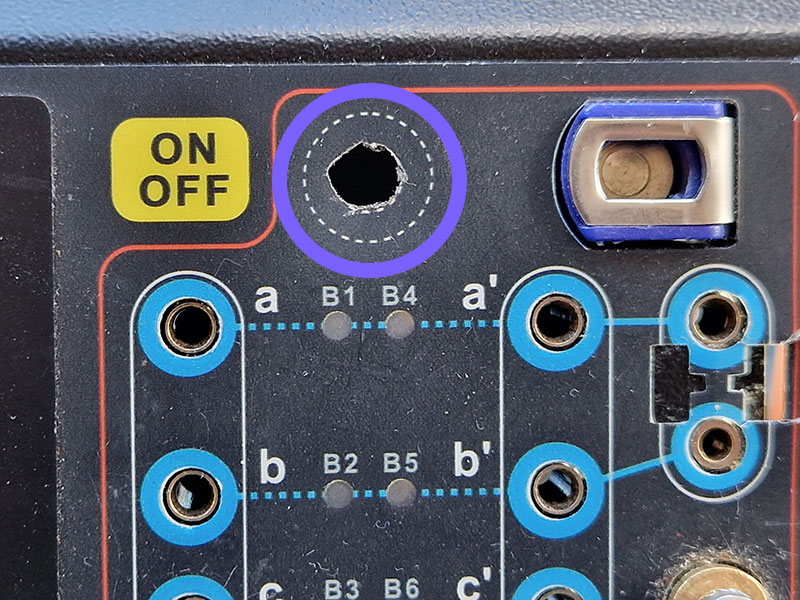

5. Insert into the hole created the first part of the device :

    - the screw;
    - 1 serrated lock washer;
    - 1 M4 × 8mm washer;
    - 1 serrated lock washer;
    - 1 M4 × 16mm washer;
    - 1 nylon M4 × 20mm washer.

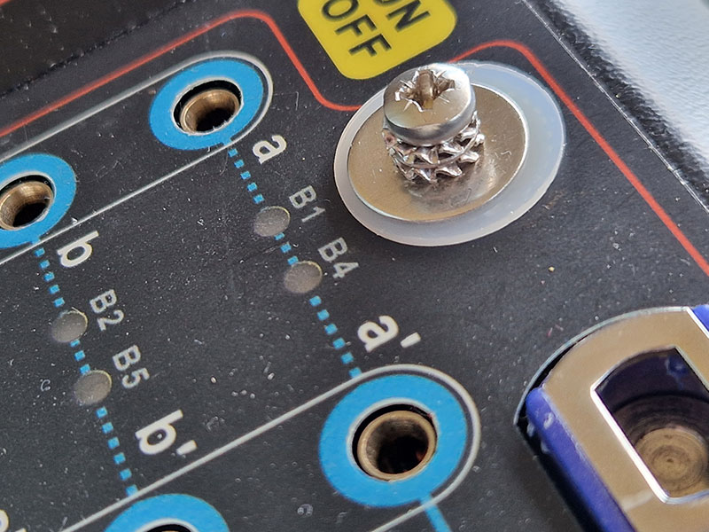

6. Flip the tester and put one M4 × 14mm washer on the screw. The washer should be placed on the adhesive side of the plastic covering in which the hole was just made.
The washer should not touch the metallic of the hole.

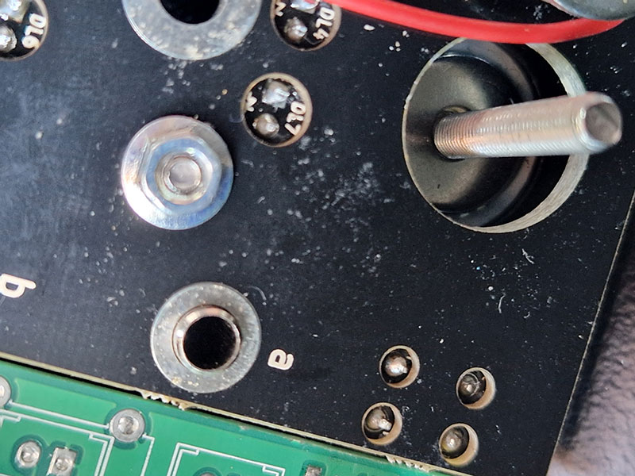

7. Remove almost entirely the screw while leaving just enough to leave the last installed washer in place.
Put one nylon M4 × 20mm washer.

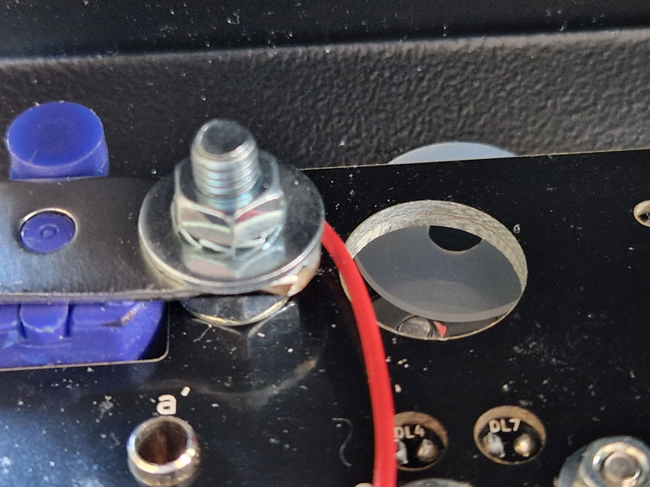

8. Once the nylon washer placed, push back the screw and place the following :

    - 1 M4 × 14mm washer;
    - 1 serrated lock washer;
    - 1 M4 × 4mm nut.

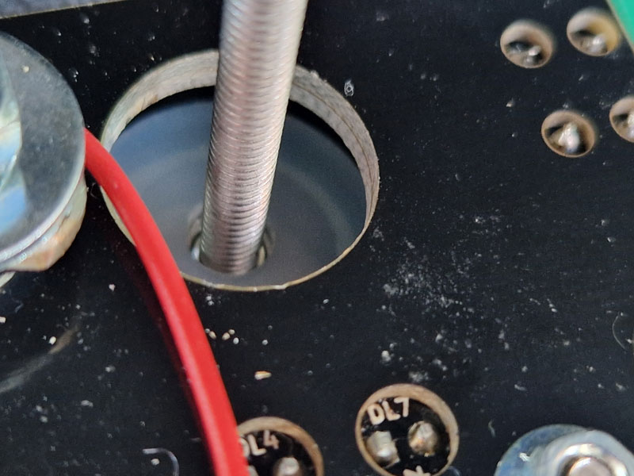

9. To tighten the nut, use a 7mm hexagon socket with a center hole of at least 5mm.
Hold the socket by hand and use a screwdriver to tighten the screw on the other side.
Torque as much as possible. This tightening insure the mechanical assembly with the face of the tester.

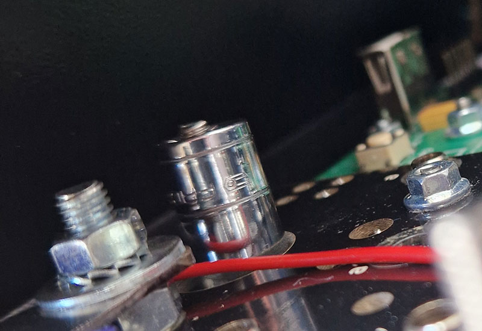

10. Add one serrated lock washer and one M4 × 3mm nut and torque everything as before.

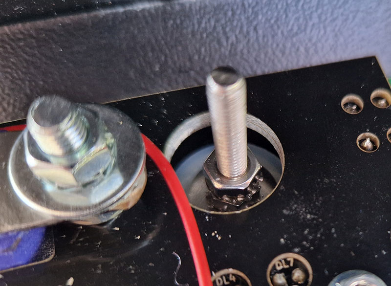

11. Add the last parts :

    - 1 nylon M4 × 20mm washer;
    - 1 M4 × 14mm washer;
    - 1 serrated lock washer;
    - 1 ring terminal crimped on the 14cm of 18AWG wire.

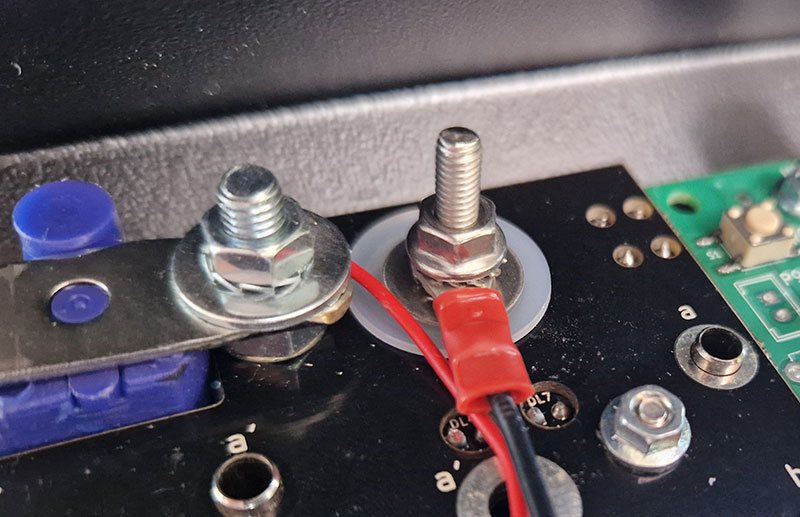

12. Torque firmly to provide good electrical contact. A 7mm wrench can be used. Proper tightening is achieve once the serrated flange click in the serrated washer.

13. Solder the wire on the side of the *C* socket accessible in the bottom corner.

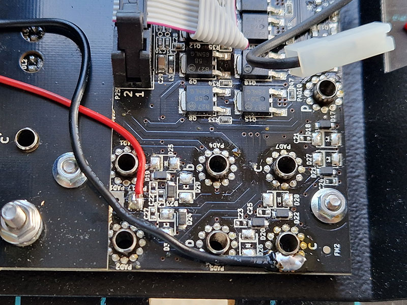

14. Plug back the batteries. The polarity diagram is printed on the batteries support. Close the tester and test the modification with the tester in *bodywire* mode and a mask wire.